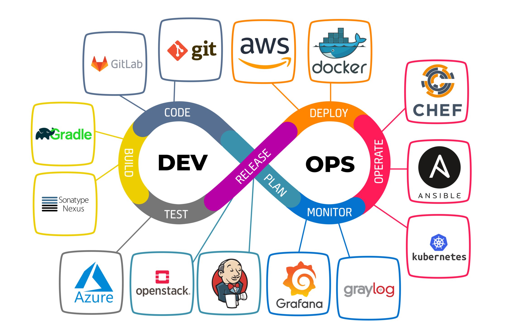

# Enu Diena 2024: Dev[Sec]Ops Edition

Github repo: https://github.com/jamezwhocares/enudiena2024

## Agenda

### Short intro (mine/yours)

### Explanations of roles

- IT Support, IT Admin/Network, PMs, Devs, QAs, [DevOps](https://en.wikipedia.org/wiki/DevOps), [DevSecOps](https://www.techtarget.com/searchitoperations/definition/DevSecOps), [Site reliability engineering (SRE)](https://en.wikipedia.org/wiki/Site_reliability_engineering)

### DevOps work flow

- The goal is to deliver an application

- [DevOps toolchain](https://en.wikipedia.org/wiki/DevOps_toolchain): Plan, Create, Verify, Package, Release, Configure, Monitor, and Version Control

### DevOps tech stack

- [Continuous integration (CI) / Continuous delivery (CD)](https://en.wikipedia.org/wiki/CI/CD)

- [Infrastructure as a Code (IaaC)](https://en.wikipedia.org/wiki/Infrastructure_as_code)

- Version control (Git, SVN)

- Clouds (Azure, AWS, GCP)

### My experience

...

### My current duties

...

### Farewell words and recommendations

- Improve your English

- Focus on education, get at leat Bachelor
    - But always do hands-on / practices
    - Assess possibity to take remote Bachelor programm (e.g., [this from Coursera/University of London](https://www.coursera.org/degrees/bachelor-of-science-computer-science-london)), but make sure you can team up with someone

- Watch some (video) tutorial on simple subject and try to understand and replicate each step, e.g., "How to set Linux web server inside Linux VM running under Virtual Box"

- Find a mentor / someone who inspires you to learn
    - Find a friend, agree on and define some (feasible) goals:

        1.1. Install Linux inside Virtual Box and configure web server with simplest "Hello World" index.html page

        1.2. Configure PHP support for web serve and create "index.php" that will print "Hello World"

        1.3. Create more Linux VMs and configure network between them

    - Create repository in Github, checkout it in your Linux VM (+ created changes, push them to Github...)

- Being a pupil/student gives a lot of discounts on many resources/platforms

## Certification

0. **Local IT-related courses**:

    0. [HelloIT](https://helloit.lv/)

1. **Foundation**:

    1.1. [CompTIA IT Fundamentals (ITF+)](https://www.comptia.org/certifications/it-fundamentals)

    1.2. [CompTIA A+](https://www.comptia.org/certifications/a)

2. **Network**:

    2.1. [CompTIA Network+](https://www.comptia.org/certifications/network), or

    2.2. [Cisco Certified Network Associate (CCNA)](https://www.cisco.com/site/us/en/learn/training-certifications/certifications/enterprise/ccna/index.html)

3. **Security**:

    3.1. [CompTIA Security+](https://www.comptia.org/certifications/security)

## Useful resources

- [CS50 from Harvard University YouTube](https://www.youtube.com/cs50)
    - [CS50/2023: full Computer Science course YouTube](https://www.youtube.com/watch?v=LfaMVlDaQ24) or [this YouTube playlist](https://www.youtube.com/watch?v=IDDmrzzB14M&list=PLhQjrBD2T380F_inVRXMIHCqLaNUd7bN4)

- [freeCodeCamp YouTube](https://www.youtube.com/@freecodecamp)

- [LeetCode Beginners Guide](https://leetcode.com/explore/learn/card/the-leetcode-beginners-guide/)

- [CodingGame](https://www.codingame.com/start/)

- [Udemy](https://www.udemy.com/)

- [Coursera](https://www.coursera.org/)

